# rs-img-classification
Semantic segmentation of remote sensing images. 

## Development enviroment
1. Operation system: Ubuntu 16.04.3 LTS 
2. CUDA version: 8.0 
3. Programming language: Python 2.7 
   Modules:  
   tensorflow-gpu==1.4.1, scikit-image==0.13.0, tifffile==0.13.5, 
   pandas==0.20.3, keras==1.2.2, h5py==2.7.0, tqdm== 4.19.4 
   
## Model
- Reference: [kaggle-dstl 3rd blog](http://blog.kaggle.com/2017/05/09/dstl-satellite-imagery-competition-3rd-place-winners-interview-vladimir-sergey/) 
- Framework: 
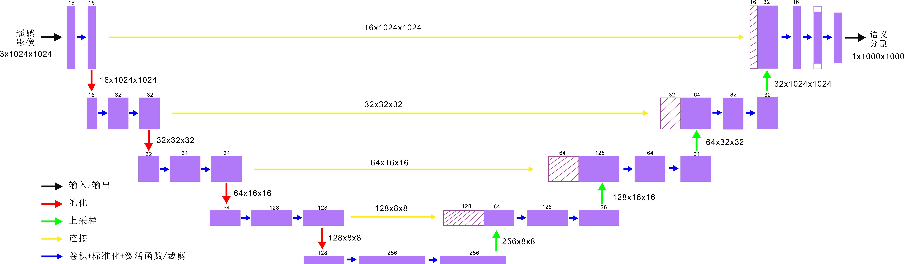 
- Input and output: 1024\*1024\*3 (in), 1000\*1000\*1 (out), row\*column\*channel

## Result
left: image, middle: ground truth(label), right: prediction 
1. Airport
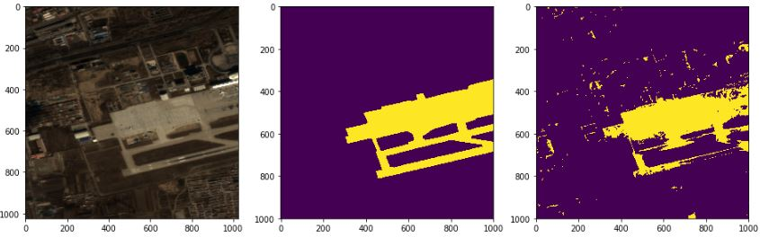 
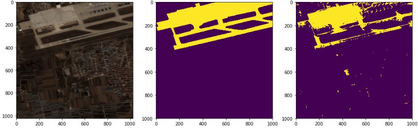 
2. Baresoil
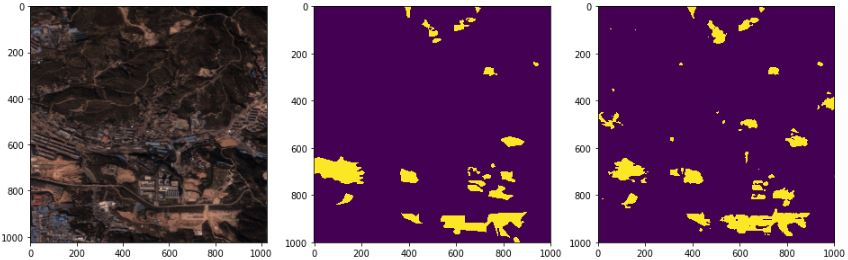 
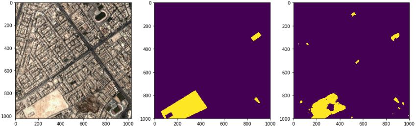 
3. Building
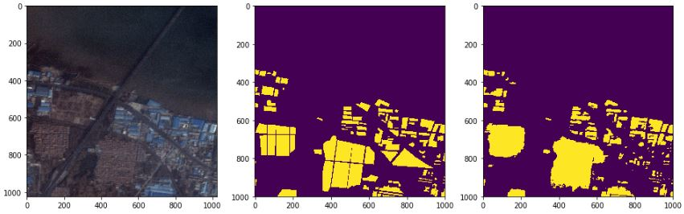 
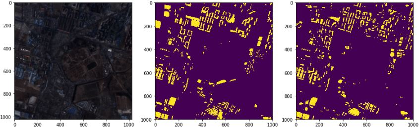 
4. Farmland
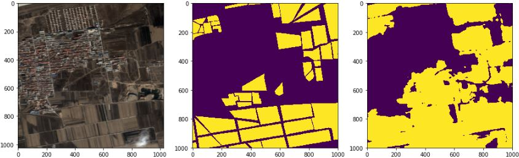 
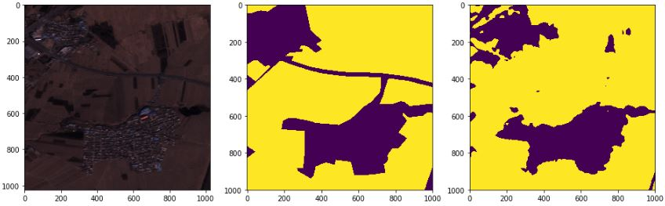 
5. Road
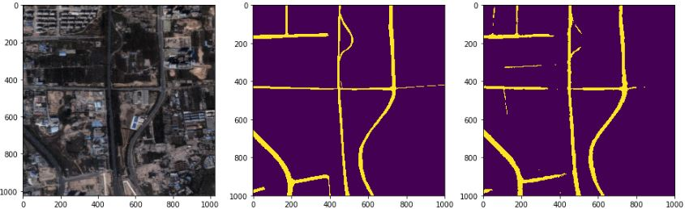 
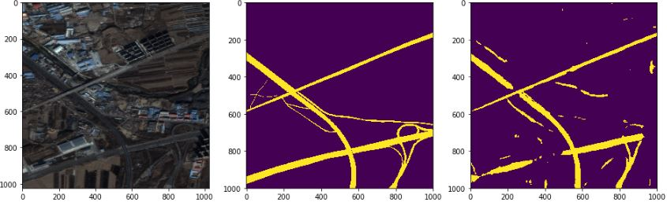 
6. Vegetation
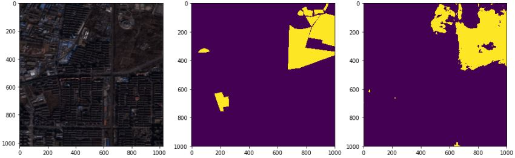 
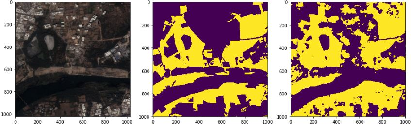 
7. Water
 
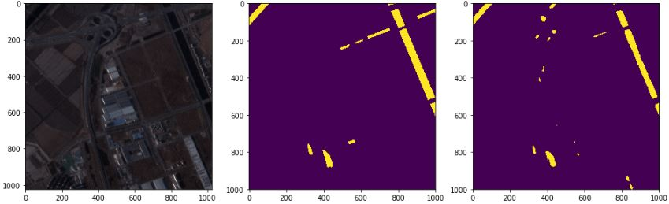 
